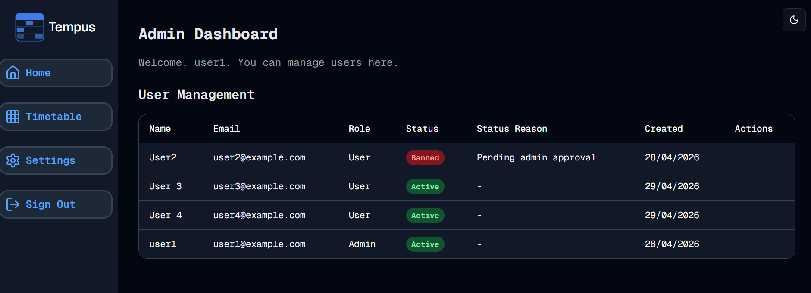

#  Admin Time
Welcome to **day 123** of 365 days of code - coding every day for a year, little and often

Ok, so after yesterday and creating the relations etc. I couldn't actually find any useful applications right now, but it is something for me to keep in mind, and at the very least the foreign keys may come into play a little in my next feature - Admin.

It's a natural progression on from the better-auth implementation and fixes a messy work around that is in place for the option to manually approve all new sign-ups. An admin page/section will allow for some basic user management options, and allow for any other future feature adds I want to make.

I got started today with the basic bones of the admin page, with the user list in a shadcn table and some pagination that I will probably replace with the shadcn one shortly.From here I need to add in the actions, and then look at some sort of list/page that shows all pending accounts. I also need to think about mobile compatibility.

One piece I added in was that the first user created is always an admin, that way for self hosted users, they should never need to dive into the DB to set this up themselves.

Anyway, more tomorrow!

> [!NOTE]
> For this Tempus I won't be copying the whole codebase into this repo every time I work on it, instead I'll just [link to the repo](https://github.com/ASam08/tempus) and even link [direct to the commit here](https://github.com/ASam08/tempus/commit/4d362340b7b5ae7a9ea178f24819e54493401815) if someone wants to go have a look at that point in time.

p.s. I know, first screenshot in ages!