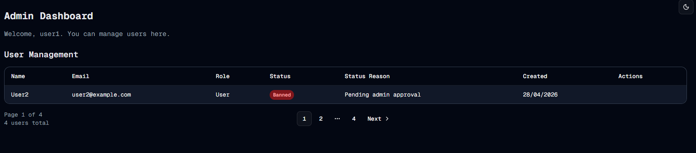

#  Pagination
Welcome to **day 124** of 365 days of code - coding every day for a year, little and often

>Come with me and you'll be
>In a world of pure imagination

I can't tell you why my brain works that way, but the word pagination, just makes me think of that song from Charlie and the Chocolate Factory...

...anyway...

Day 124 and today I wanted to focus on the pagination piece. Given this was the first time I've done pagination in this project, or in nextJS, another good chance to learn. One of the first things I did was import the pagination components from shadcn. I then started to look at the pagination logic, and about halfway through I thought, "hmm, I'm probably going to need this elsewhere at some point" and put a bunch of the logic into a function in the utils file.

And it all works, beautifully if I do say so myself. I even did the mobile friendly parts for the pagination (I need to go back and do this for the rest of the page when the table is finished). I did also write some jest tests just for the getPaginationItems function in the utils file, I'll do the ones for the admin page itself later on.

Anyway, that's it for today, more tomorrow!

> [!NOTE]
> For this Tempus I won't be copying the whole codebase into this repo every time I work on it, instead I'll just [link to the repo](https://github.com/ASam08/tempus) and even link [direct to the commit here](https://github.com/ASam08/tempus/commit/8c103f8187b65426bba77ac47fef923044d8ec32) if someone wants to go have a look at that point in time.

