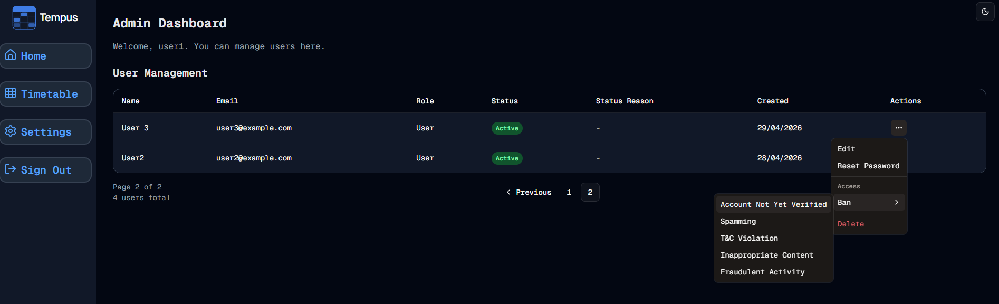

#  Ban/Unban
Welcome to **day 125** of 365 days of code - coding every day for a year, little and often

Today was one of those days where I felt like I really got it. I set about working on the admin actions for users today, staring off by creating a dropdown menu in the actions column. I got the UI together and felt happy with where I was and then started looking at actually implementing the actions.

First I went to my actions file and started to write out a function to unban a user, then it clicked, I moved to better-auth for a reason, I bet they already have that built in, and of course, they do! So I deleted the few lines of code I had written and went to implement that. The Better-Auth stuff for this is straight forward, 2 lines of code, that's it, but then I tried to add the onClick and realised, hang on, I'm in a server component at a page level, I need client components for clicks. So I moved the actions drop down off into it's own component, and went about setting that all up.

I ran out of time in the end, but I now have the ban and unban set up and working, amazing how quick that can be done (thank you Better-Auth). Ban only shows up when the account is enabled, and unban when it's disabled (makes sense).

Anyway, screenshot is below, more tomorrow!

> [!NOTE]
> For this Tempus I won't be copying the whole codebase into this repo every time I work on it, instead I'll just [link to the repo](https://github.com/ASam08/tempus) and even link [direct to the commit here](https://github.com/ASam08/tempus/commit/c0d1d8dd3271a5dc8a0a3f6757572b69e737030a) if someone wants to go have a look at that point in time.

