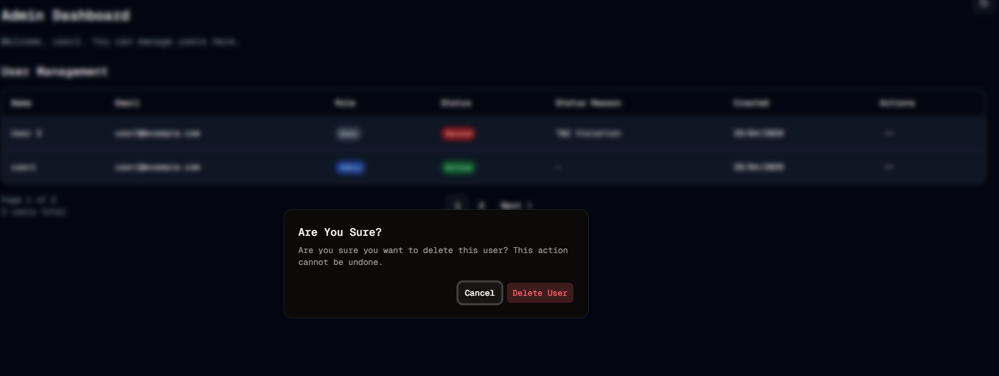

#  Danger Zone
Welcome to **day 126** of 365 days of code - coding every day for a year, little and often

Today was more work on the admin actions, moving into the danger zone, changing a users role to admin or user, and deleting a user entirely.

I'm still feeling more comfortable with things and that's a good feeling, I wanted to add an "Are you sure?" alert dialog for both of these actions today, and whilst I'm sure I could have combined them into one alert dialog and worked out the logic to switch depending on what was clicked, I just felt more comfortable having one for the role change and one for the deletion.

Probably the most nervous bit for me today was testing the delete user, I honestly haven't deleted one before on this DB and I just didn't know if it would all flow ok, but it did so thank goodness for that. I do need to set up a user with all of the timetable blocks etc. make a note of all of their id's and then delete them just to make sure everything does cascade properly, but so far so good.

I also want to add a block before the "are you sure" alert dialog to stop an admin from changing their own role or deleting themselves. Both this and the full delete test are on the list for tomorrow, so I guess tune in then!

> [!NOTE]
> For this Tempus I won't be copying the whole codebase into this repo every time I work on it, instead I'll just [link to the repo](https://github.com/ASam08/tempus) and even link [direct to the commit here](https://github.com/ASam08/tempus/commit/b4fa6e3baa08e7108bcdc1f34d0c6db297329453) if someone wants to go have a look at that point in time.

