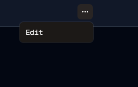
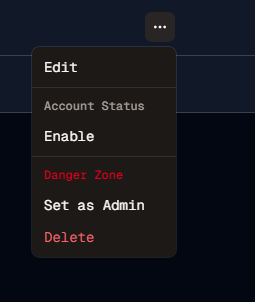

#  Protect Thyself
Welcome to **day 127** of 365 days of code - coding every day for a year, little and often

Not a big piece of work today, I mentioned yesterday I wanted to stop admins doing something silly like deleting themselves or changing their own roles, but then I realised I also wanted them to not be able to ban themselves as it would also result in an instant sign out.

So I basically just hid the options from them, I had to bring the session user id across to the client component, check if it's themselves and then only show those choices if it's not themselves.

Pretty straight forward, when you think about the simplest way to approach it.

Whilst I was there, I also went about writing the tests for the adminactions component, a fair bit of writing, especially with all the shadcn components (I know I should make centralised mocks for them...), but good to have it done.

Anyway, more tomorrow!

> [!NOTE]
> For this Tempus I won't be copying the whole codebase into this repo every time I work on it, instead I'll just [link to the repo](https://github.com/ASam08/tempus) and even link [direct to the commit here](https://github.com/ASam08/tempus/commit/30ab1282c0fb8bf2812e0c48e26b0f9588e11ee2) if someone wants to go have a look at that point in time.

 