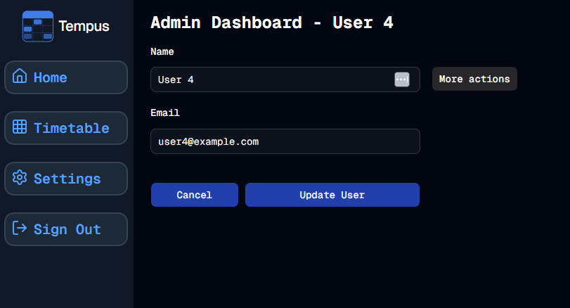

#  User Edits
Welcome to **day 128** of 365 days of code - coding every day for a year, little and often

It has felt really good over the last few days to actually be building stuff again, it's a nice change. Today I put together the form for the "Edit" option on the admin actions. It's pretty simple at the moment, just allowing for changing of users name and email, as well as the other actions already available.

A few things I need to sort out:
1. Remove the edit option from the dropdown when already on the edit page (I think this will be straightforward)
2. Some sort of feedback when the admin tries to change the email address to one that already exists. At the moment it just fails and no feedback, I want the fail to continue, but we need to show why. This one seems a little more challenging on the face of it.
3. Make it mobile friendly
4. Tests...

Anyway, I'm pretty happy with today, more tomorrow!

> [!NOTE]
> For this Tempus I won't be copying the whole codebase into this repo every time I work on it, instead I'll just [link to the repo](https://github.com/ASam08/tempus) and even link [direct to the commit here](https://github.com/ASam08/tempus/commit/52933a926e6410584b950b5a3f3e6d60d611f1c5) if someone wants to go have a look at that point in time.

