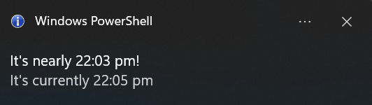

# Keep Me On Track
Welcome to **day 13** of 365 days of code - coding every day for a year, little and often

Things have been changed up a bit today. I have noticed at work, I easily get sucked into work a bit too deep and I need to be dragged out of it a little, keep myself on track and make sure I'm spreading my time across the various priorities that I have, so I wanted to create a little pop up on my screen every half an hour, giving me a heads up that it's nearly been 30 minutes since the last one. Something to break the cycle.

I'm sure there are a number of tools that can do this for free, but work is a pretty locked down environment (as enterprises should) and I doubt I could run anything, plus it presented as an opportunity to code something.

Given the above point aboue locked down environments, I knew powershell would be the way to go, but only using the built in libraries. This meant not being able to use burnt toast for pop-ups, however after not very much googling, I found an alternative using system.windows.forms, something I knew nothing about.

Anyway, I wrote up the script with hard-coded variables for the 30 minutes, 2 minute notification ("It's nearly 10:00am, it's currently 9:58am"), then later on realised that wasn't very friendly or re-usable, so I've edited the logic to allow for any frequency and notification lead-time, as long as it's at least once an hour. I have set it up to trigger upon login via windows task scheduler.

A cool little project, a chance to get out of Python for a minute and something that I will be using daily.

