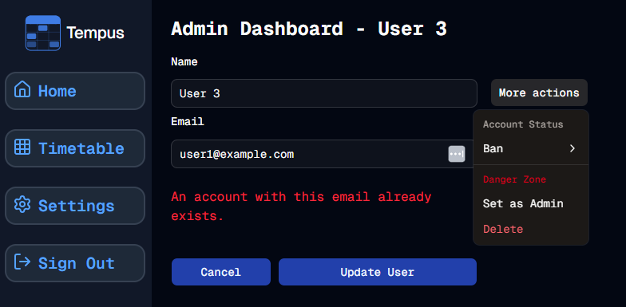

#  Laundry List
Welcome to **day 130** of 365 days of code - coding every day for a year, little and often

Today was a good chance to sort out some of the laundry list of things to sort from day 128:

> A few things I need to sort out:
> 1. Remove the edit option from the dropdown when already on the edit page (I think this will be straightforward)
> 2. Some sort of feedback when the admin tries to change the email address to one that already exists. At the moment it just fails and no feedback, I want the fail to continue, but we need to show why. This one seems a little more challenging on the face of it.
> 3. Make it mobile friendly
> 4. Tests...

So after ticking of some of number 4 yesterday, it was time to sort out the big boys, 1 & 2.

1 was pretty straight forward, I added an optional parameter to the dropdown component, that I could then use to hide the edit option, and when I call it from the edit page, I just add that parameter set to true and bye bye edit option.

I spent a bit more time on number 2. First I read through the docs on Better-Auth, then I took a look at the actual code. Now... I do not fully understand the implications of it, but I can see how it is done when a normal user updates their email and it checks for it, and I can't see any checks when an admin does it. For some reason it doesn't block it off the bat when a normal user does it either, I imagine there is good reason for that, but I don't know it. Anyway, it gave me the way that it is done in better-auth, basically just search for users with that email address, and if it exits, then handle it, and that's basically what I did.

I also updated the toast message for a general error, and added in validation to the page for the duplicate email error. Because I was looking at the sign-in form for a guide for some stuff, I realised I had used the same name for the type for both sign-in and user edit, so I updated both to be more specific.

Lastly I changed the URL for the edit user page to actually have edit in it, so instead of dashboard/admin/\[UUID], it now has ddashboard/admin/**edit**/\[UUID].

Phew, that seems like a lot. Just two things left on the list, mobile friendly and then (sigh) tests...

...more tomorrow!

> [!NOTE]
> For this Tempus I won't be copying the whole codebase into this repo every time I work on it, instead I'll just [link to the repo](https://github.com/ASam08/tempus) and even link [direct to the commit here](https://github.com/ASam08/tempus/commit/d714f190758573324b02b2e9c03508374888c71d) if someone wants to go have a look at that point in time.

