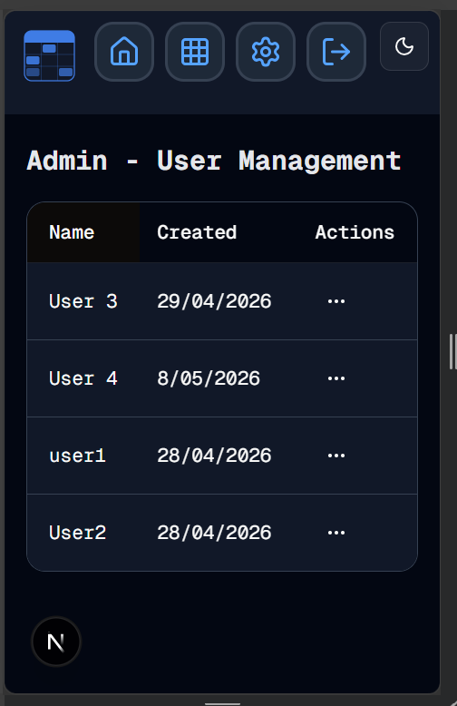

#  Make It Friendly
Welcome to **day 131** of 365 days of code - coding every day for a year, little and often

Today's focus was on the mobile friendly item from the to-do list. Most of it was pretty straight forward, the only thing that took a few cracks was the sticky first column in the user table, mostly just getting the background colour correct, until I clicked - "bg-background", sometimes it is that simple...

Anyway, I also made some copy changes in a few places, and updated the tests for the admin page itself.

That's it for today, more tomorrow...testing...

> [!NOTE]
> For this Tempus I won't be copying the whole codebase into this repo every time I work on it, instead I'll just [link to the repo](https://github.com/ASam08/tempus) and even link [direct to the commit here](https://github.com/ASam08/tempus/commit/770520d9555f84f3ae91435afc830f51a3996da9) if someone wants to go have a look at that point in time.

