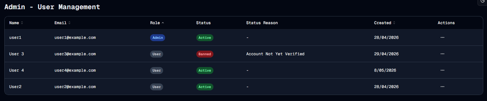

#  Sorted
Welcome to **day 134** of 365 days of code - coding every day for a year, little and often

A solid day today, I implemented the sortable headers for the admin user table, updated the tests for it, and...it all works...no dramas, no nothing. The more I do, the more confident and comfortable I get, the simpler it all starts to be, not a bad feeling. It's been cool using searchParams, not something I've done too much with, but also not too complicated (so far).

I didn't get to the filters for banned users, admins etc, but that just gives me something to look at for tomorrow I guess.

More tomorrow!

> [!NOTE]
> For this Tempus I won't be copying the whole codebase into this repo every time I work on it, instead I'll just [link to the repo](https://github.com/ASam08/tempus) and even link [direct to the commit here](https://github.com/ASam08/tempus/commit/52123cad9556f117b9575fc1367789f06abcf53e) if someone wants to go have a look at that point in time.

