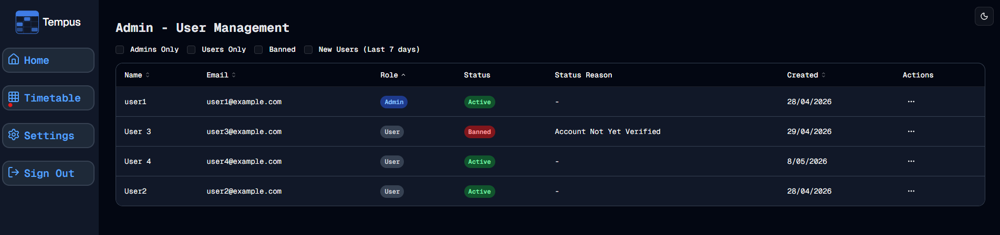

#  Filters
Welcome to **day 135** of 365 days of code - coding every day for a year, little and often

Today felt like a really good day, I set to work on the filters, and apart from a few layout issues that took me a bit to work out, it works just as I had hoped and planned! another really good success day, and it actually didn't feel to hard. I knew what I wanted to achieve, I had a plan in my head for how to do it, and away we go.

One limitation of better-auth's list-users in the admin plugin is that you can only filter by one field in a query, but to be honest that's ok for me for right now.

I did push myself a little, and added a filter for new users in the last 7 days, this took a minute to think about how I needed to format the date correctly, but I got it, and I'm really pleased with the overall result.

I even wrote the tests for the new SearchFilters component, I just ran out of time today to update the tests for the admin page, so I will get back to that tomorrow, and then as far as I can see, this feature should be ready for release, another big step.

More tomorrow!

> [!NOTE]
> For this Tempus I won't be copying the whole codebase into this repo every time I work on it, instead I'll just [link to the repo](https://github.com/ASam08/tempus) and even link [direct to the commit here](https://github.com/ASam08/tempus/commit/7bd93012d614453cd231eb47886b600e4c111f9e) if someone wants to go have a look at that point in time.

