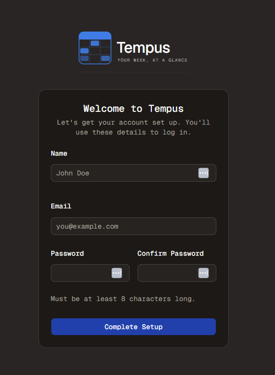

#  Tinker Time
Welcome to **day 142** of 365 days of code - coding every day for a year, little and often

Today was a bit of a painful day, it went a bit like this:
- Build the dev docker image
- Update the test container
- It doesn't work or there is an issue
- Work out what the problem is
- Fix it
- Blow away the docker volume and replace it with the one from the backup
- Back to the top

You'll notice I had a backup that I was using, worth it's weight in gold today, and thoroughly recommended for testing, a good known working backup to roll back to, so that you can test again and find the next issue.

And after all of that...

~~...It's still not quite working~~

...It's alive!!!

Ok, I started writing this during one of the many image builds, but I finally found the issues, worked them all out. Some of them were actually to do with the way I have better-auth configured for running locally without https for example, but either way, problems are sorted and we are looking in good shape.

I am going to test from scratch again tomorrow when I'm a bit fresher and make sure I haven't missed anything, but I'm feeling hopeful that we're nearly there.

Anyway, more tomorrow!

> [!NOTE]
> For this Tempus I won't be copying the whole codebase into this repo every time I work on it, instead I'll just [link to the repo](https://github.com/ASam08/tempus) and even link [direct to the commit here](https://github.com/ASam08/tempus/commit/a3e155b18444dd0cb69ca8d446384ca88f44ec98) if someone wants to go have a look at that point in time.

