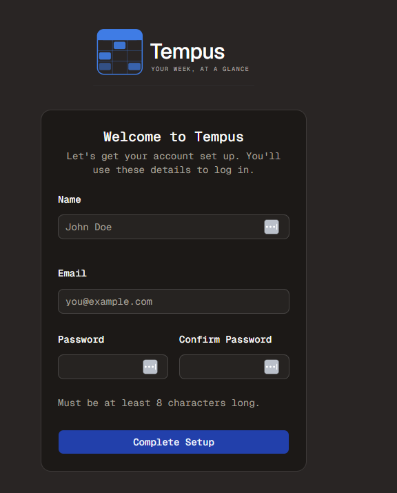
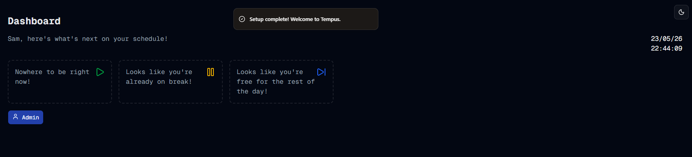

#  Well That Works
Welcome to **day 143** of 365 days of code - coding every day for a year, little and often

A few tweaks made today before another full run through, and I guess the title says it all, it works!

The tweaks were:
1. Replace the BETTER_AUTH_URL with a new env variable TEMPUS_URL, BETTER_AUTH_URL when run in docker is always going to be localhost:3000, but I need another URL to use for setting the allowed origins, so TEMPUS_URL it is. I also updated the documentation to reflect the new variable.
2. I added a check for missing required env variables at app startup time, so when it invariably crashes, there will be something clear in the logs to say what's missing.

Then I rebuilt the dev image, pushed it to another non-auth instance I have (after backing up the volume of course) and it worked perfectly, just as expected.

I did notice that for some reason the admin module has changed itself to US locale dates, which is weird, but that's something for another day.

The only things left to do are to finish off by updating the tests, creating the release (which will be a breaking changes one), add back in the previously commented out migrations for the foreign keys and we are away and laughing, we'll see how much of that gets done tomorrow, more then!

> [!NOTE]
> For this Tempus I won't be copying the whole codebase into this repo every time I work on it, instead I'll just [link to the repo](https://github.com/ASam08/tempus) and even link [direct to the commit here](https://github.com/ASam08/tempus/commit/7336db6817847b253a2799a42b4556d5825bb27a) if someone wants to go have a look at that point in time.

