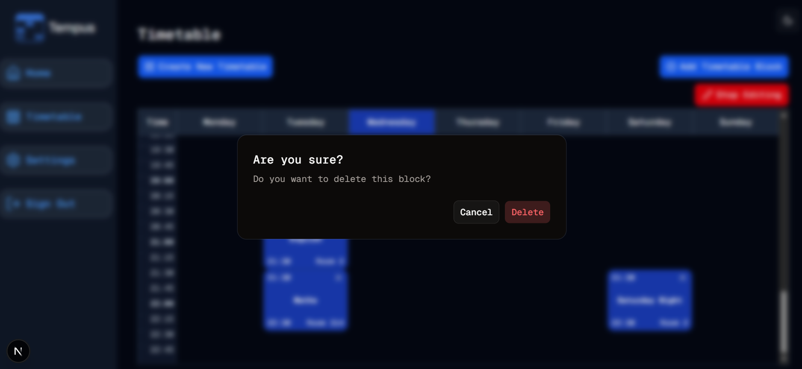

#  Small But Steady
Welcome to **day 147** of 365 days of code - coding every day for a year, little and often

I wanted to launch into the email stuff today, but writing up the changes yesterday, I realised that I didn't want that inconsistent experience for deleting a block to stay. It was a rush job when I put it in, taking the lazy way out by using the built in pop up box, but not the same as what I'm doing elsewhere, so today I fixed that instead.

It was a pretty small change, and something I'm more comfortable with doing in nextjs/react now, certainly more than I was when I wrote the component originally, so with a few states added, and the alert dialog, it all worked out pretty well.

I could add in the block title or something to the dialog box, I probably should, but I didn't today, something for another day perhaps.

Anyway, more tomorrow!

> [!NOTE]
> For this Tempus I won't be copying the whole codebase into this repo every time I work on it, instead I'll just [link to the repo](https://github.com/ASam08/tempus) and even link [direct to the commit here](https://github.com/ASam08/tempus/commit/276e2f9ad134cd252f2d91f657da0bb39228dde9) if someone wants to go have a look at that point in time.

