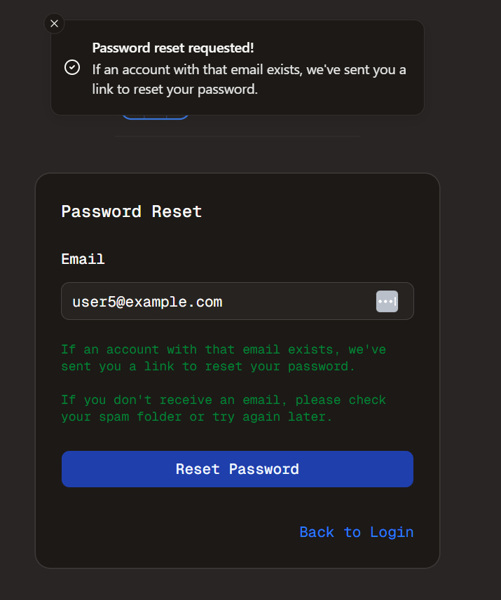

#  Email - Part 3
Welcome to **day 150** of 365 days of code - coding every day for a year, little and often

150 days in, it feels like it's getting close to halfway there (well it is the end of 5 months, so that's a bit of an obvious statement I guess). Today is still part of the email series, but there wasn't a whole bunch of stuff done specifically on email implementation.

Today I focussed on the UI for the password reset form, and added a forgot password link to the login page. I also did some formatting and copy on the password reset email template itself.

I'm pretty pleased with how it looks as a form, and added in toast messages for after a request is made.

Tomorrow I think will be working on what happens when that link is actually clicked, so watch this space for that.

> [!NOTE]
> For this Tempus I won't be copying the whole codebase into this repo every time I work on it, instead I'll just [link to the repo](https://github.com/ASam08/tempus) and even link [direct to the commit here](https://github.com/ASam08/tempus/commit/407c98f085b74a9288fffaa8a96c7c2c8d7257b3) if someone wants to go have a look at that point in time.

