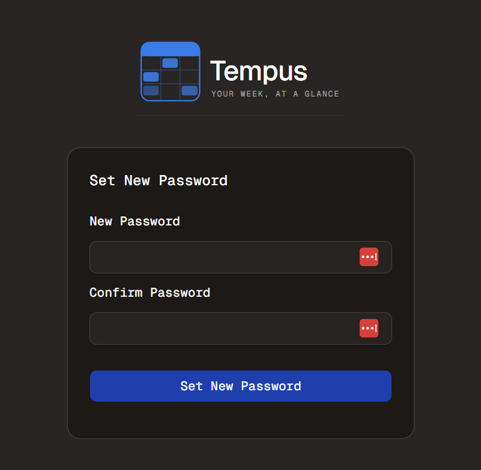

#  Email - Part 4
Welcome to **day 151** of 365 days of code - coding every day for a year, little and often

Another pretty successful day today, building out the logic and UI for the form to actually set a new password once the forgot password flow has resulted in an email in your inbox.

To be honest, this was pretty straight forward, I have built the whole thing in the page component (I did this with the request password reset page too), which I know isn't normally the right way to go, so I think I'll probably need to tidy that up (maybe tomorrow), but it is working pretty nicely.

I also probably should add the password requirements up front, instead of only when they aren't met, similar to what I've done for the signup page, maybe I can create that as a reusable component (maybe I should?).

Anyway, sounds like I've just filled my day for tomorrow, so see you then!

> [!NOTE]
> For this Tempus I won't be copying the whole codebase into this repo every time I work on it, instead I'll just [link to the repo](https://github.com/ASam08/tempus) and even link [direct to the commit here](https://github.com/ASam08/tempus/commit/f4be2e21baca496c2f65acbfd9c0492535b9815c) if someone wants to go have a look at that point in time.

