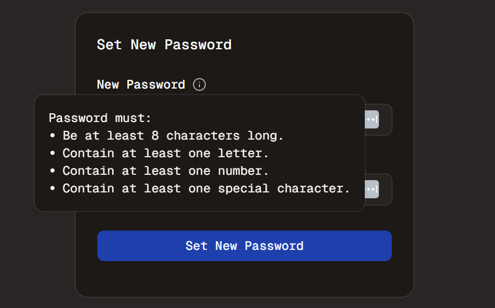

#  Email - Part 5?
Welcome to **day 152** of 365 days of code - coding every day for a year, little and often

A pretty small bit of code today, but good practice, and probably straying away (even more than the last few days) from the email implementation. I probably could be calling this reset-password implementation, but I'm not, so there.

I mentioned yesterday that I should implement the password requirements as a resuable component. When I went back to look at the sign-up form, I realised I only actually had the minimum 8 characters on the screen, unless you missed any of the other requirements. Sure it's standard to have an upper case letter, number and special character, but if you don't say it up front, how will people know.

Anyway, I went about putting together a component that is just a hover card, including the circled i trigger, then adding it to both the sign-up page and the reset-password page in the password field.

Like I said, not a massive piece of code, but important from both a UI and UX perspective, as well as good practice in generating reusable components.

Anyway, more tomorrow!

> [!NOTE]
> For this Tempus I won't be copying the whole codebase into this repo every time I work on it, instead I'll just [link to the repo](https://github.com/ASam08/tempus) and even link [direct to the commit here](https://github.com/ASam08/tempus/commit/495db575eafe51abbfe719cbfb3653a3558b1bc5) if someone wants to go have a look at that point in time.

