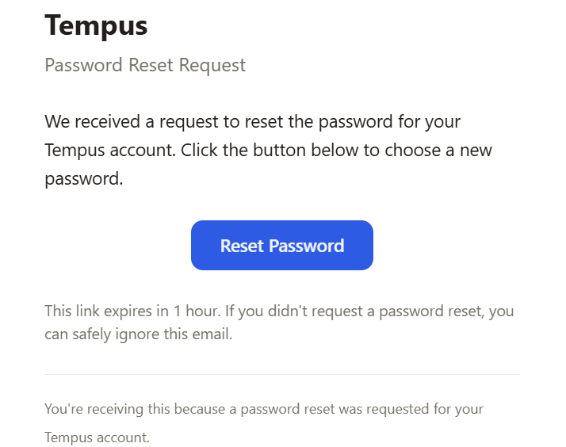

#  Email - Part 12
Welcome to **day 162** of 365 days of code - coding every day for a year, little and often

Today was a bit more of a dive into the email templates and getting my head around react email styling. To be honest I'm pretty pleased with the result, a pretty stylish looking email, that does what it needs to. Can't ask for much more than that. I will need to take what I've learned and apply it to the welcome email tomorrow I think.

Honestly once I had worked out the different components available in react-email, the trickiest bit was getting the colours correct. I'm sure there's a way that I can pull this from the globals.css but it didn't seem to obvious and I ran out of time on it today.

My to-do list from day 157 of things I want to do before publishing this as a release are:
1. ~~Add in the new ENV variables to the startup check~~
2. ~~Make sure that the app will run without the ENV variables (but obviously without the password reset functionality)~~
3. ~~Update the doco~~
4. Tidy up the templates to look a bit nicer (Halfway there!)
5. ~~Add in the welcome email to the new user flow~~
6. (Day 161) Make sure that the welcome email is optional and doesn't cause an issue when email isn't configured.

More tomorrow!

> [!NOTE]
> For this Tempus I won't be copying the whole codebase into this repo every time I work on it, instead I'll just [link to the repo](https://github.com/ASam08/tempus) and even link [direct to the commit here](https://github.com/ASam08/tempus/commit/43d8254cdd59af3a0ef4a1a30f13c37b0f0bbb6a) if someone wants to go have a look at that point in time.

