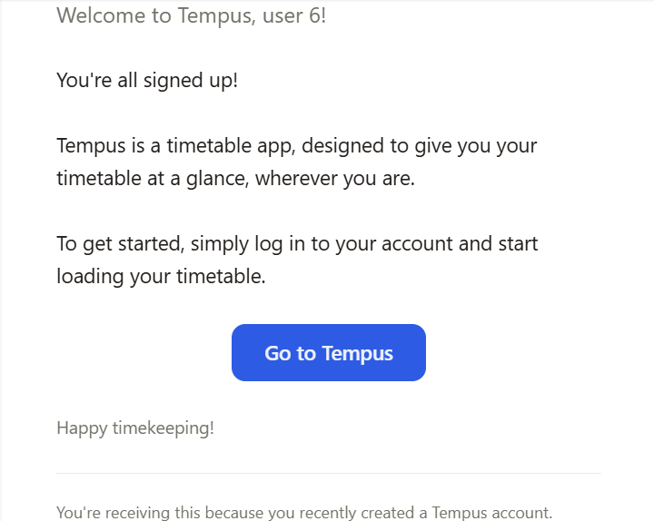

#  Email - Part 14
Welcome to **day 164** of 365 days of code - coding every day for a year, little and often

I mentioned yesterday I wish there was a way to preview my emails, well it turns out there is, and it's part of react-email, which I'm already using. So that was a quick result from google...

Anyway, today I went through and updated the welcome email with the same styling as the password reset email, and we're away laughing. I also tested and made sure that the welcome email was optional so it doesn't cause a crash or error when email ENV variables is missing.

My to-do list from day 157 of things I want to do before publishing this as a release are:
1. ~~Add in the new ENV variables to the startup check~~
2. ~~Make sure that the app will run without the ENV variables (but obviously without the password reset functionality)~~
3. ~~Update the doco~~
4. ~~Tidy up the templates to look a bit nicer~~
5. ~~Add in the welcome email to the new user flow~~
6. ~~(Day 161) Make sure that the welcome email is optional and doesn't cause an issue when email isn't configured.~~

I do still need to go through and update the tests for it, and then I think it will all be ready for release. I guess I know what I'll be doing tomorrow!

> [!NOTE]
> For this Tempus I won't be copying the whole codebase into this repo every time I work on it, instead I'll just [link to the repo](https://github.com/ASam08/tempus) and even link [direct to the commit here](https://github.com/ASam08/tempus/commit/e1f24bca3f1420b10d00ea75e0d02d19b8ba1e6f) if someone wants to go have a look at that point in time.

