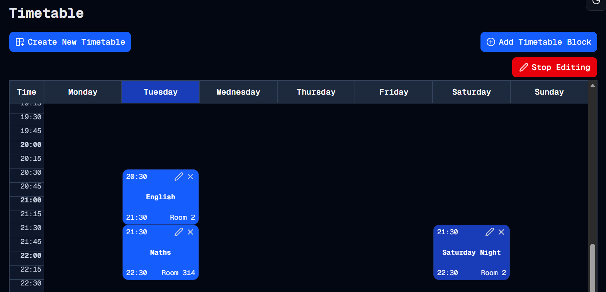

#  It's In The Edit
Welcome to **day 167** of 365 days of code - coding every day for a year, little and often

Today it was time to review the to-do list, with the email integration done, it's time to tackle editing a timetable block. 
- [x] ~~Add in some sort of testing so that I can...~~
- [x] ~~...Sort out some more thorough CI/CD workflows~~
- [x] ~~Swap from auth.js to better-auth. It seems to have a lot more functionality out of the box, something to look into anyway. It would also open the gate towards password resets/changes as well.~~
- [x] ~~Future auth improvement - email integration to allow password resets~~
- [ ] Edit a timetable block, instead of having to delete it and create a new one
- [ ] Multiple timetable sets for a user. Some of the readiness for this exists, but not implemented. Coming with that might also be sharing timetable sets across users...
- [ ] Consider replacing the data/actions files with actual API flows.
- [ ] Maybe internationalisation
- [ ] Future auth improvement - Other sign in methods OAuth, etc.
- [ ] Future auth improvement - Allow logged in user password change

So I've kicked off adding the edit form today, starting off with creating the edit page itself, a placeholder form and adding in the logic to go from the timetable page to the edit block page. I basically renamed the deleteblock pieces to editblock, added in a edit icon that shows when edit mode is active, and pushes to the edit page when clicked.

All of that works, so the groundwork is there, ready for the form to be fleshed out, I guess that's the job for tomorrow!

> [!NOTE]
> For this Tempus I won't be copying the whole codebase into this repo every time I work on it, instead I'll just [link to the repo](https://github.com/ASam08/tempus) and even link [direct to the commit here](https://github.com/ASam08/tempus/commit/4851141f37b96a1c3d539d34a295a8f74a456661) if someone wants to go have a look at that point in time.

