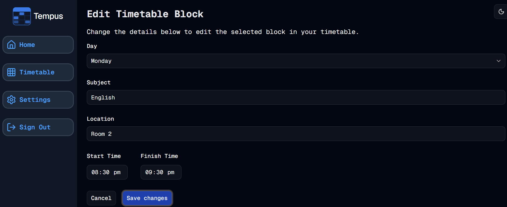

#  Formulating
Welcome to **day 169** of 365 days of code - coding every day for a year, little and often

In a way, having the add block form already done was a bit of a pain, it meant that ne of the biggest decisions to make was whether or not to copy the code and adjust, or write from scratch for the edit block. I know I want the look and feel to be very similar, and alot of the logic is already there, but it also means going through and finding all the logic that has to change, instead of writing everything from scratch.

In the end I went with copying it and editing it, it means the bulk of the work is done for me, it just makes it a bit more finicky. It does however force you to review the code, and that's not a bad thing. For example, a good while ago I moved some common functions into a lib file, and it turns out that the create timetable block form was still using it's own definition, so it was a chance to update it to use the common one, and delete a few lines of code (woohoo?).

Anyway, the form is there, and a good chunk of the logic has been updated, it needs a bit more time, I need to get the day of week select box to show the current one, and I need to pass the block ID back to the action so that it can know which block we are updating, but otherwise it's (hopefully) most of the way there.

That's it for today, more tomorrow!

> [!NOTE]
> For this Tempus I won't be copying the whole codebase into this repo every time I work on it, instead I'll just [link to the repo](https://github.com/ASam08/tempus) and even link [direct to the commit here](https://github.com/ASam08/tempus/commit/3a56b11acef3f56984ff5d97db2bc202833b164d) if someone wants to go have a look at that point in time.

