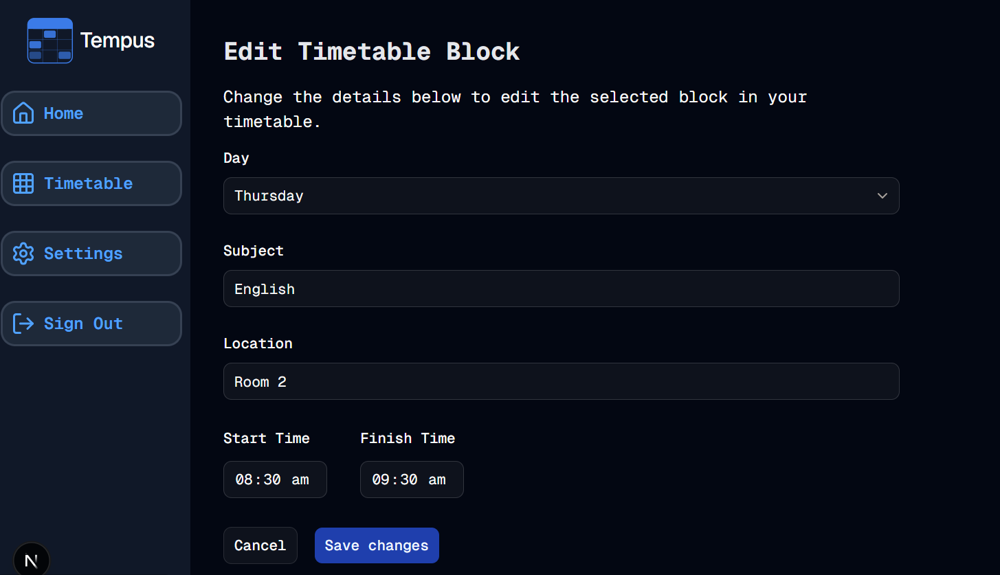

#  Rendering...Please Wait
Welcome to **day 170** of 365 days of code - coding every day for a year, little and often

Ok, so today I got what I hope is the last of the build work done on the edit form. I worked out my issues with the select default value, a combination of not quite having the conversion correct from the number to the day of week value, and then running into rendering issues, as shadcn Select apparently doesn't like having the default value calculated before it fully renders, the fix was bascically to use key to show the same value to get it to load, then placeholder to also show the same value until key had rendered. Seems a little bit over the top, but it works and the end user experience is better for it.

I also bound the blockId server side, instead of using a hidden form id etc. I haven't done that before so it took a little research, but it seems like a pretty elegant solution to reduce the risk around manipulating requests from the client side, although I still run userId checks as part of the server action to ensure that one user can't change another user's blocks if they somehow manage to manipulate the blockId.

Lastly, I found a small issue that it didn't seem to like changing the day of week, which threw an error that the end time was before the start time. Luckily this was just an issue with the zod validation, given it wants HH:MM but the browser was submitting with seconds on it, so stripping the seconds off did the trick there.

All that is left to do know is to write up the tests, check through everything and hopefully that should be it done.

More tomorrow!

> [!NOTE]
> For this Tempus I won't be copying the whole codebase into this repo every time I work on it, instead I'll just [link to the repo](https://github.com/ASam08/tempus) and even link [direct to the commit here](https://github.com/ASam08/tempus/commit/cc2fe6f29e0938e4c6cda22be41a3e1fa5fda279) if someone wants to go have a look at that point in time.

