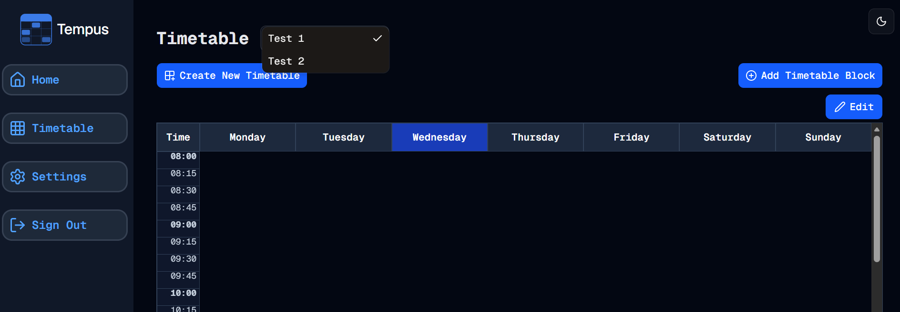

#  Multiple Timetables
Welcome to **day 182** of 365 days of code - coding every day for a year, little and often

Sometimes it really is surprising how much you can get done once you know how. I set about today working through the next item on the to-do list, multiple timetable sets. I honestly thought this would be a pretty big piece of work, but as I went through it, I found more and more, it was actually pretty straight forward to implement. I started off by adding the select box with some dummy items, then created the function to get all the timetable sets instead of just one. After that it was just about making the functionality work with the timetable itself updating depednding on the choice, and then UI.

I actually ended up removing a component that I realised could be absorbed into the timetable page component as well as simplifying the process to get the userid, now that I can use the better-auth api. I also tidied up some of the conditional rendering and I'm pretty happy with how things are looking now. It's actually really good to go back and look at some of this earlier code now that I have a bit more experience and confidence, because I can see better ways to do things now.

And so the basics of the feature are all in and done. I do have a few things I need to sort out though.
1. I want to store the last viewed timetable in settings (I think this is the right place to do it) so that it pulls that as the timetable to view next time you navigate to the timetable page, at the moment, it's just the first one alphabetically.
2. I need to handle the !user_id better than a message that says please log in, in theory this shouldn't be possible now with better-auth, but good to have it catered for.
3. I will need to adjust the add block and edit block components to receive the timetablesetid to make sure they update the correct timetable set and not cause issues.
4. Update the dashboard page to account for multiple timetables.
5. My old friend tests...

And I think that will probably be it, but that list above started with 2 things before I started writing it, so we'll see...

- [x] ~~Add in some sort of testing so that I can...~~
- [x] ~~...Sort out some more thorough CI/CD workflows~~
- [x] ~~Swap from auth.js to better-auth. It seems to have a lot more functionality out of the box, something to look into anyway. It would also open the gate towards password resets/changes as well.~~
- [x] ~~Future auth improvement - email integration to allow password resets~~
- [x] ~~Edit a timetable block, instead of having to delete it and create a new one~~
- [ ] Multiple timetable sets for a user. Some of the readiness for this exists, but not implemented. Coming with that might also be sharing timetable sets across users...
- [ ] Consider replacing the data/actions files with actual API flows.
- [ ] Maybe internationalisation
- [ ] Future auth improvement - Other sign in methods OAuth, etc.
- [ ] Future auth improvement - Allow logged in user password change

More tomorrow!

> [!NOTE]
> For this Tempus I won't be copying the whole codebase into this repo every time I work on it, instead I'll just [link to the repo](https://github.com/ASam08/tempus) and even link [direct to the commit here](https://github.com/ASam08/tempus/commit/017c819479ed93158314748e9fa5aa5650b1cd3f) if someone wants to go have a look at that point in time.

