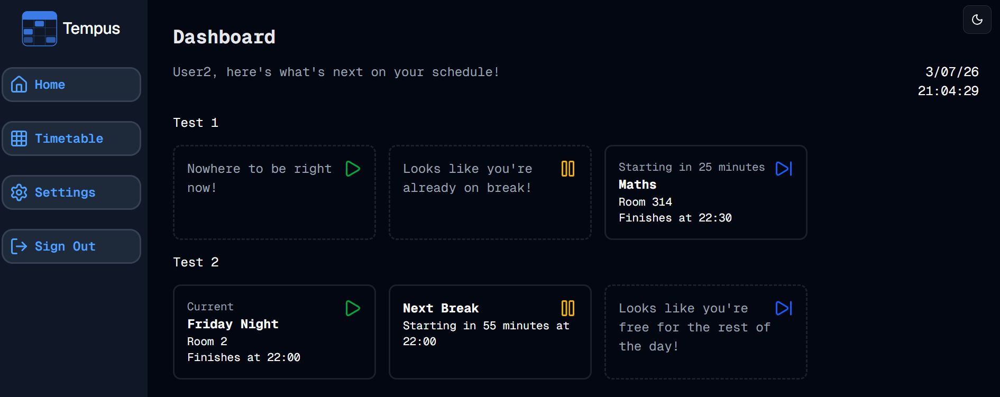

#  Multi Dashboard
Welcome to **day 184** of 365 days of code - coding every day for a year, little and often

Another day where it feels like I acomplished alot, but it also didn't feel too hard, I like these days. I did manage to tick 2 items off of the list below, but I also added 2 so...

Anyway, I kicked off by updating the dashboard to have a line per timetable, so now you can see what's happening across all of your timetables at a glance. This was pretty quick to implement to be honest, and helped by the way I had set things up before with the cards, however I do need to go back and do a little bit of tidy up on this because I got the dashboard all done, went to verify before tidying up and realised that I had no way to add blocks to anything but the first timetable.

That meant jumping into the next piece, editing the add block page/components to use the timetablesetID from the timetable page that called it. That also wasn't too much of a hassle, the biggest thing was thinking about the best way to do it, without allowing the client part (the form) to control the timetablesetID. Luckily I had come across this when I was adding the edit block form the other day, so I was able to use what I learned there with binding the constant on the server side, and it all looks pretty good.

I didn't get a chance to look at the edit block page, I think this will actually be ok, because we use the blockID for it, but I'll double check this to make sure.

I also went ahead and checked for any further uses of the getTimetableSet data fetch, and found I had replaced everything with the getAllTimetableSets data fetch, so went ahead and removed that function. I tried to tidy up references in the test files, but I know they are going to be messy and need a fair bit of attention at the end, joy of joys...

1. ~~I want to store the last viewed timetable in settings (I think this is the right place to do it) so that it pulls that as the timetable to view next time you navigate to the timetable page, at the moment, it's just the first one alphabetically.~~
2. ~~I need to handle the !user_id better than a message that says please log in, in theory this shouldn't be possible now with better-auth, but good to have it catered for.~~
3. ~~I will need to adjust the add block component to receive the timetablesetid to make sure it updates the correct timetable set and not cause issues.~~
4. ~~Update the dashboard page to account for multiple timetables.~~
5. Check the edit block component doesn't have any issues or gaps with there being multiple timetablesetid's possible now.
6. Tidy up the extra code now left behind in the dashboard card components and data fetches.
7. My old friend tests...

Anyway, that's it for today, more tomorrow!

> [!NOTE]
> For this Tempus I won't be copying the whole codebase into this repo every time I work on it, instead I'll just [link to the repo](https://github.com/ASam08/tempus) and even link [direct to the commit here](https://github.com/ASam08/tempus/commit/c36f7eb60ff5bfe33fd60da3c45879b44846bc7a) if someone wants to go have a look at that point in time.

