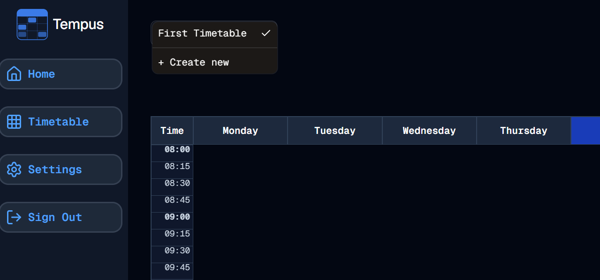

#  Timetable Tweaks
Welcome to **day 191** of 365 days of code - coding every day for a year, little and often

So I've been thinking about the UI of the timetable page the last few days, and I've decided there are some tweaks I want to make:

1. Remove the timetable heading and replace it with the timetable select component.
2. Add the create new option to the timetable select and remove the button.
3. Move the add timetable block to the timetable grid component, allowing me to have the add block and edit buttons on the same row.
4. Add the timetable description to the page somewhere.

So with that in mind, today I knocked out 1 and 2. Removing the heading wasn't all that hard, and neither was moving the create new flow to the timetable select component to be honest. I had to work through a bit of the logic for when there are no timetables, or only one, and I also had to update the onvaluechange piece for the select component, but they were pretty straight forward. I like that shadcn has the separator component so that I could make it clear that it was a separate section, I might also add an edit or manage in there later on, now that I think about it.

Anyway, all looks good and working, I've also got a placeholder in for the timetable description. Of course I haven't updated any tests, but to be fair I want to make all my changes first.

And that's me for today, more tomorrow!

> [!NOTE]
> For this Tempus I won't be copying the whole codebase into this repo every time I work on it, instead I'll just [link to the repo](https://github.com/ASam08/tempus) and even link [direct to the commit here](https://github.com/ASam08/tempus/commit/28bf8b20719273abc8412d1dc76894c5bad2bd24) if someone wants to go have a look at that point in time.

