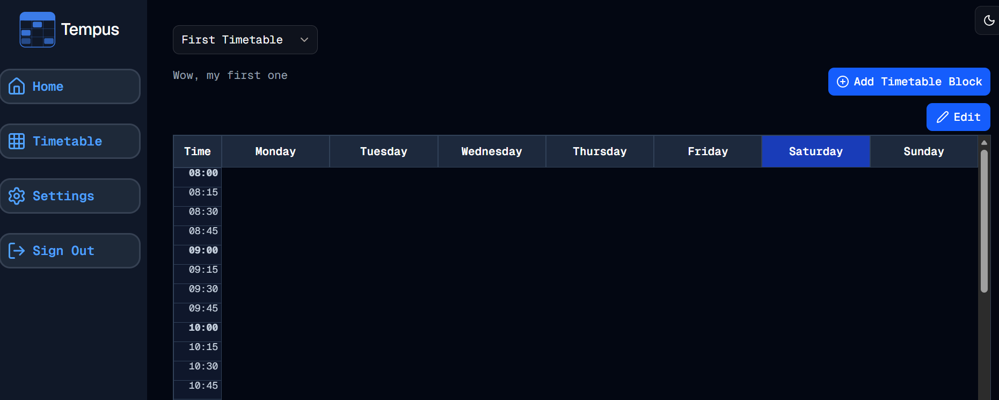

#  Described
Welcome to **day 192** of 365 days of code - coding every day for a year, little and often

One of those low-on-time days today, so I picked the easiest thing left on the UI list and added the timetable set description to the timetable page. This was mostly a case of changing the data retrieval to include the description field, then looking it up based on the current displayed timetable, and then using that information. I think it looks pretty tidy, but I guess I'm biased. I also added to the list below

1. ~~Remove the timetable heading and replace it with the timetable select component.~~
2. ~~Add the create new option to the timetable select and remove the button.~~
3. Move the add timetable block to the timetable grid component, allowing me to have the add block and edit buttons on the same row.
4. ~~Add the timetable description to the page somewhere.~~
5. Add manage timetable sets functionality
6. Do I look at different days/hours per timetable?

And that's me, more tomorrow!

> [!NOTE]
> For this Tempus I won't be copying the whole codebase into this repo every time I work on it, instead I'll just [link to the repo](https://github.com/ASam08/tempus) and even link [direct to the commit here](https://github.com/ASam08/tempus/commit/6edd141db176cba809edd8c212b1d63583f314b0) if someone wants to go have a look at that point in time.

