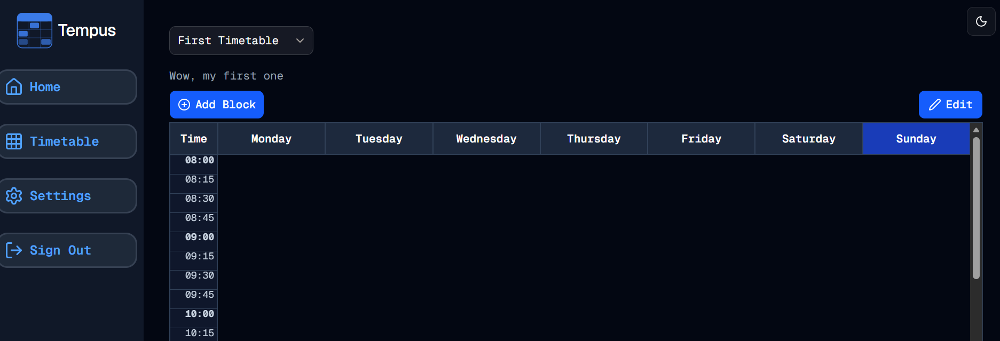

#  Moving Around
Welcome to **day 193** of 365 days of code - coding every day for a year, little and often

Not a massive day today, but I did knock out moving the add timetable block from the timetable page component to the timetable grid component. This wasn't actually too much hard work, just a case of passing the setId to the timetable grid as well, and lifting and shifting the button over. A few minor tweaks to get it looking just right, and we're away and laughing.

1. ~~Remove the timetable heading and replace it with the timetable select component.~~
2. ~~Add the create new option to the timetable select and remove the button.~~
3. ~~Move the add timetable block to the timetable grid component, allowing me to have the add block and edit buttons on the same row.~~
4. ~~Add the timetable description to the page somewhere.~~
5. Add manage timetable sets functionality
6. Do I look at different days/hours per timetable?

No real gotchas today, more tomorrow!

> [!NOTE]
> For this Tempus I won't be copying the whole codebase into this repo every time I work on it, instead I'll just [link to the repo](https://github.com/ASam08/tempus) and even link [direct to the commit here](https://github.com/ASam08/tempus/commit/0f51d9ddf3b1aba8659b03adf79d3762c7a6ab11) if someone wants to go have a look at that point in time.

