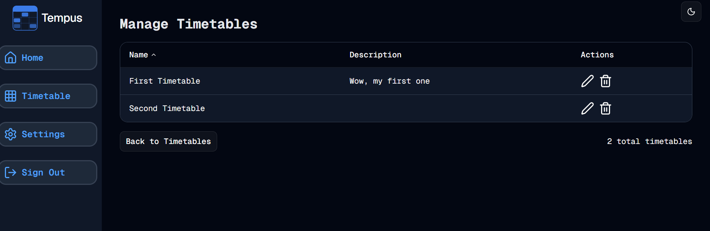

#  Managing Sets
Welcome to **day 194** of 365 days of code - coding every day for a year, little and often

Seeing as how I had wittled down my list, I started tackling what is probably the bigger piece of all of this, managing timetable sets. I started off by adding it to the drop down, and while I was there, I replaced the + for new timetable with the appropriate lucide sign. I then got to work creating the page. For simplicity sake and to keep the theme common, I borrowed heavily from the admin page, where the users are listed. It actually worked really well and I think the output is pretty good. I added in a return to timetables button and removed the admin actions, replacing it with lucide signs for edit and delete.

I now need to get into the functionality for editing and deleting, I guess that is a job for tomorrow!

1. ~~Remove the timetable heading and replace it with the timetable select component.~~
2. ~~Add the create new option to the timetable select and remove the button.~~
3. ~~Move the add timetable block to the timetable grid component, allowing me to have the add block and edit buttons on the same row.~~
4. ~~Add the timetable description to the page somewhere.~~
5. Add manage timetable sets functionality - In progress
6. Do I look at different days/hours per timetable?

> [!NOTE]
> For this Tempus I won't be copying the whole codebase into this repo every time I work on it, instead I'll just [link to the repo](https://github.com/ASam08/tempus) and even link [direct to the commit here](https://github.com/ASam08/tempus/commit/a6b920ceefd07acd744313b01d9d759245d1a574) if someone wants to go have a look at that point in time.

