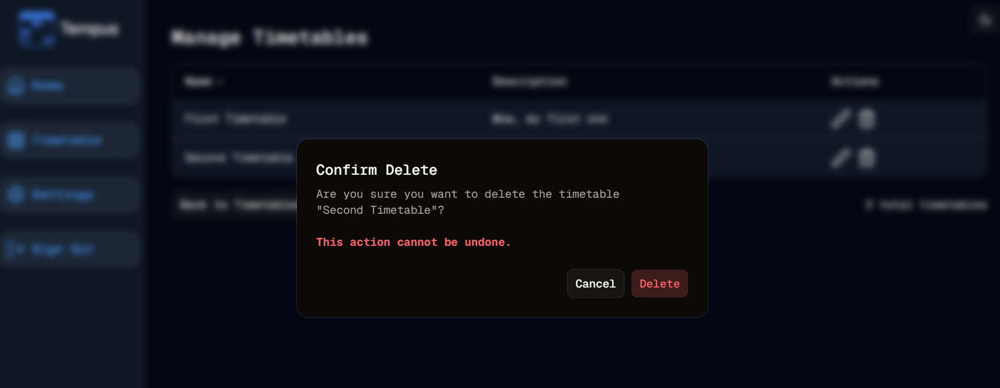

#  Delete Sets
Welcome to **day 195** of 365 days of code - coding every day for a year, little and often

More good progress today on the manage timetables, getting the delete flow set up end to end. I started by moving the manage actions into their own client component, similar to what I did for the admin actions piece for user management. I then went about putting in the logic for deleting the set, with the alert dialog check, and then the delete server action. I was very conscious on the security for this action, so it checks ownership before deleting, but also in the DB command as well.

When testing it, I realised that if the deleted set was the last one to be viewed, it was still in settings as the last timetable, so it was trying to render it. I solved this in two places, first in the delete action, I put a call to check if this was the case, and null out the setting if it is. I also then in the timetable page itself changed the selectedSet flow to check if the selected set was valid, if not then it defaults to the first one.

Then in testing, I obviously was creating timetables, and realised that when you create one, it doesn't default to that set, which is a bit rubbish from a UX perspective. Luckily I learned that you can use .returning in drizzle to return row information when inserting a row, super handy (so glad I went with drizzle), so changing that bad UX to a better one was really straightforward.

Anyway, that feels like a fair chunk for today, and it is, so I'll leave it there. Tomorrow will be sorting out the edit timetable flow, which I'm hoping should be pretty simple, given I have done this recently for the edit block, so can reuse alot from that.

While I remember, I also want to add a "create new timetable" to the manage page, it seems a little painful that you have to go back to the timetable page to create a new one, especially when you're in a "manage" page.

See you then!

> [!NOTE]
> For this Tempus I won't be copying the whole codebase into this repo every time I work on it, instead I'll just [link to the repo](https://github.com/ASam08/tempus) and even link [direct to the commit here](https://github.com/ASam08/tempus/commit/58ea389f3cec7087e27c8567185fa654969a6d64) if someone wants to go have a look at that point in time.

