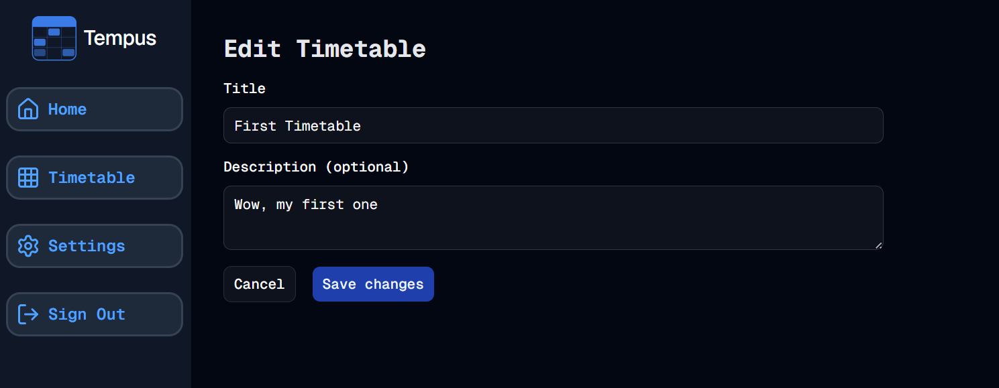

#  Edit Sets
Welcome to **day 196** of 365 days of code - coding every day for a year, little and often

Yet another pretty successful day, adding in the edit sets functionality. It was relatively straightforward as expected, but even with being able to recycle parts of the codebase from other similar functionality, it was still felt like quite a lot of code to write, including new data pulls and server actions, but I got there in the end and it feels pretty seamless (to me anyway).

No real gotchas today, just grinding through it to be honest. I am dreading the test writing a little...
I didn't get around to adding the create timetable button for the manage page, I know it's a tiny piece of work, I just missed it today. And I made the call that I won't look at different days/hours per timetable just yet, maybe that's something for the future.

Anyway, more tomorrow!

1. ~~Remove the timetable heading and replace it with the timetable select component.~~
2. ~~Add the create new option to the timetable select and remove the button.~~
3. ~~Move the add timetable block to the timetable grid component, allowing me to have the add block and edit buttons on the same row.~~
4. ~~Add the timetable description to the page somewhere.~~
5. ~~Add manage timetable sets functionality.~~
6. Add a create timetable option from the manage page
7. Do I look at different days/hours per timetable? - Not yet

> [!NOTE]
> For this Tempus I won't be copying the whole codebase into this repo every time I work on it, instead I'll just [link to the repo](https://github.com/ASam08/tempus) and even link [direct to the commit here](https://github.com/ASam08/tempus/commit/c519df2f052371b7abb15cec95f26e963c376b05) if someone wants to go have a look at that point in time.

