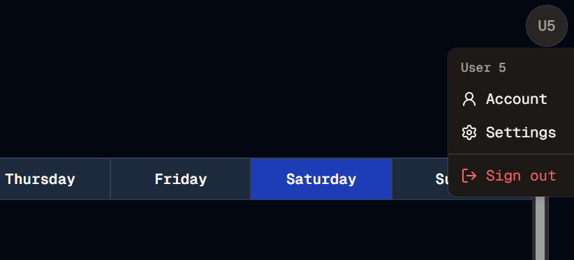

#  Avatar (Not the movie)
Welcome to **day 199** of 365 days of code - coding every day for a year, little and often

I've been starting to think that the sidenav menu is a little old school and not quite as tidy as I would like, so I'm planning a change, and maybe even a complete move away from it. It starts with putting the settings and signout buttons in one place, alongside a new account page which I will create, for password resets etc. They are all going to live in an avatar style menu. I'm not actually planning on handling image uploads currently, I'm just getting initials and using the fallback, which handily comes built into the ShadCn Avatar component.

I'm pretty happy honestly with how quickly I could chuck something basic together and have it functional, another reminder of how far I've come, along with how handy the ShadCn library is.

So I got as far as creating the avatar function, with the dropdown menu, moving the light/dark mode button to the bottom right, avatar in the top right, and removing the settings and sign out button from the sidenav, not bad progress for one day.

Tomorrow will probably getting the account page built out, or at least started. See you then!

> [!NOTE]
> For this Tempus I won't be copying the whole codebase into this repo every time I work on it, instead I'll just [link to the repo](https://github.com/ASam08/tempus) and even link [direct to the commit here](https://github.com/ASam08/tempus/commit/61517553a47196cc7b5052110957a01339d80530) if someone wants to go have a look at that point in time.

