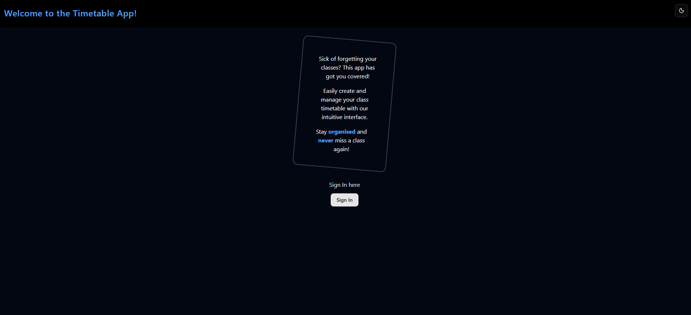

# Basic Next.js - On My Own
Welcome to **day 20** of 365 days of code - coding every day for a year, little and often

After finally completing the Next.js [app router tutorial](https://nextjs.org/learn/dashboard-app) yesterday, I wanted to start putting what I've learnt into practice. Building an app completely from scratch (without vibe coding it) is going to take some time, it will be incremental gains, so today I have put together a basic landing page and placeholder login page for an app idea that I have for timetables (more on that another time).

The tutorial I did was great, because it did all the CSS and HTML for me, it was just about learning the react side of things, but in the real world that's not how it works. I haven't used tailwindCSS properly before so that is definitely taking some getting to grips with, and I haven't written front end stuff for a long time, so a fair bit of trial and error, but I'm happy with the progress so far.

I won't be copying the whole codebase into this repo every time I work on it, instead I'll just [link to the repo](https://github.com/ASam08/timetable-app) and even link [direct to the commit here](https://github.com/ASam08/timetable-app/commit/78fb6dcfef6c697f07069f3417a4591c2dcb6d52) if someone wants to go have a look at that point in time.

