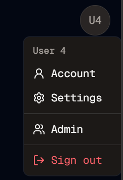

#  Avatar Admin
Welcome to **day 200** of 365 days of code - coding every day for a year, little and often

Day 200, feels like another big milestone, but in reality it was just another day where I didn't really have much time. I was geting started on the account page, when I realised I should probably move the admin button into the avatar menu, and remove it from the homepage. This meant moving the logic across from the dashboard page, and then adding the conditional, then trying to remember which of my users were admins so I could test it (always the last ones you try).

I also realised that when I set up the initials for the avatars, I was taking the first and second names, but of course some people, in fact quite alot of people, have more than two names in their names (if that makes sense), so I made the call to take the first and last name, which meant a minor change in logic, and also capitalising everything, to make it consistent.

And after that, all I have on the account page is a completely empty file, I guess that means more tomorrow!

> [!NOTE]
> For this Tempus I won't be copying the whole codebase into this repo every time I work on it, instead I'll just [link to the repo](https://github.com/ASam08/tempus) and even link [direct to the commit here](https://github.com/ASam08/tempus/commit/a1cb5f0a2be07f0856e32cfdfe3186ddbd5e98f8) if someone wants to go have a look at that point in time.

