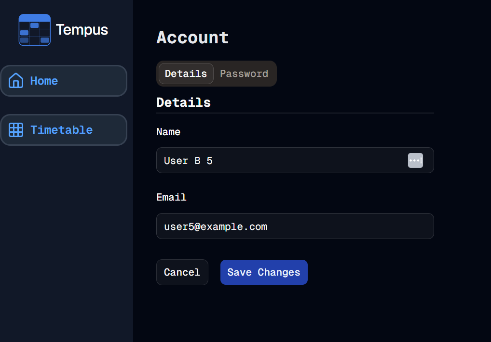

#  Account Page
Welcome to **day 201** of 365 days of code - coding every day for a year, little and often

Well I got stuck into the account page today. I didn't put any of the logic into it, none of the server actions that are going to be needed (although I think alot of it can be done by better-auth), just the UI for now.

I started off deciding to have different sections, and the best way I could think to represent that was with tabs, another shadcn component comes into play for me. I then set about thinking how I wanted the form to look, what I wanted on each page, and I now have the bones of something here. Next steps will be to look at the logic side of things, and get a basic version up and running.

Side quest - I think I'm going to split first and last name out as separate fields in the DB, the migration is going to be a little painful, but it feels like the right thing to do, especially now I'm using initials etc. I'll think about it a little bit more, but the longer I leave it the more fixing I have to do when I do it, so it will probably happen soon.

Anyway, that's enough for today, more tomorrow!

> [!NOTE]
> For this Tempus I won't be copying the whole codebase into this repo every time I work on it, instead I'll just [link to the repo](https://github.com/ASam08/tempus) and even link [direct to the commit here](https://github.com/ASam08/tempus/commit/e0965a0ca487d65ac3d8f6efd8172e5fc3092d4c) if someone wants to go have a look at that point in time.

