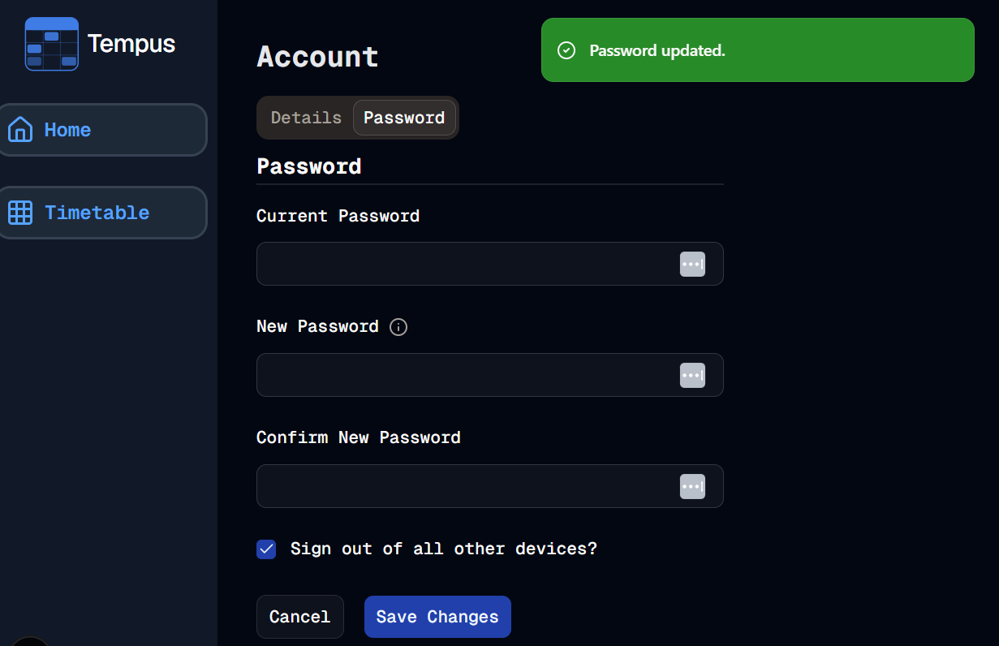
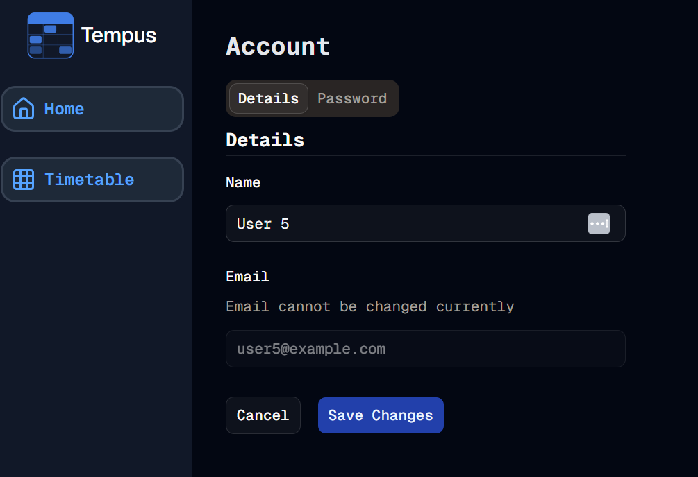

#  Account Logic
Welcome to **day 202** of 365 days of code - coding every day for a year, little and often

A pretty big day today, getting almost all of the account update logic in. I started off by putting together the handle form submit for the password, got it all working the way I wanted (with the exception of validation, that is still to be done), with all the toast messages etc. and then realised that I would have to do the same for the details tab. I looked at the code and didn't really want to write it all out again, making sure I got the feel of the toast messages the same etc. and then thought it would be even worse when I had more tabs later on...

So I took a look at how I could make the function as generic as possible whilst still having all the relevant logic in place, so that I can add more later, and keep that feel the same. To be honest I'm pretty pleased with the result, it all works, it's reusable, and adding in another form for another tab later on is pretty straight forward, I just have to add in the specific update logic and I'm away and laughing (hopefully).

I did run into some issues with updating the email address, obviously that's something you want to be careful with from an account takeover perspective, so I need to think about how best to do that, so I've disabled that input for right now.

I also need to sort out my validation for, well, everything, as at the moment it doesn't exist, I guess that makes tomorrow a Zod day.

Anyway, that's more than enough for today, more tomorrow!

> [!NOTE]
> For this Tempus I won't be copying the whole codebase into this repo every time I work on it, instead I'll just [link to the repo](https://github.com/ASam08/tempus) and even link [direct to the commit here](https://github.com/ASam08/tempus/commit/4be546ae454e15940b3b2e55a8dca6d814d9d5a0) if someone wants to go have a look at that point in time.

