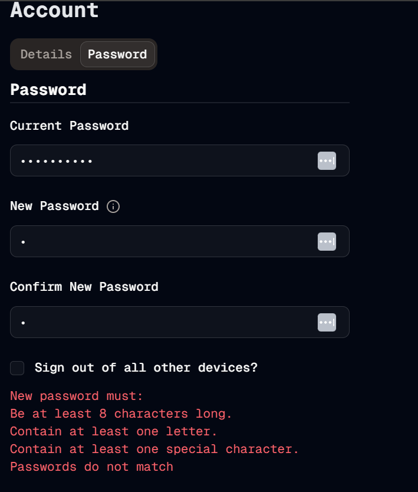

#  Change Validation
Welcome to **day 203** of 365 days of code - coding every day for a year, little and often

Another good day today, working through all the zod validation for both forms (details and password). A few small tweaks that I had to make along the way to get it all working, especially because the errors is expecting a single message, and I wanted to make sure to display that properly with all the different password messages. Because the password can have so many things wrong with it as well, I wanted to show all of the failures, instead of that frustrating experience where you fix one thing, just to be told there is another one.

Anyway, it's all in and working well now. I didn't look at the change email functionality just yet, but to be honest I'm leaning towards making that a part 2 problem, and just get this out the door for now.

I still haven't made the call on the first/last name thing yet, again, I think it's probably a part 2 call if I change it, and I will probably return to my old friend testing tomorrow and get this feature merged in as it is to start with.

Having said that, I also do want to think about whether or not I can get rid of the sidenav completely now, or what that gets replaced with, also maybe a part 2 (or maybe part 1.5) issue.

Anyway, testing for me tomorrow, see you then!

> [!NOTE]
> For this Tempus I won't be copying the whole codebase into this repo every time I work on it, instead I'll just [link to the repo](https://github.com/ASam08/tempus) and even link [direct to the commit here](https://github.com/ASam08/tempus/commit/46b0e75a0c916430d96172598860a747abf51509) if someone wants to go have a look at that point in time.

