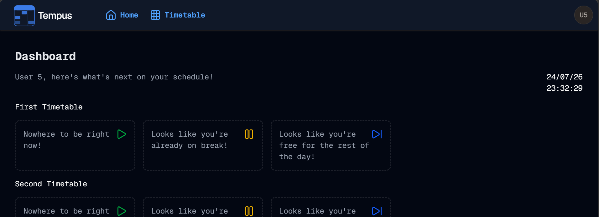

#  SideNav -> TopNav
Welcome to **day 205** of 365 days of code - coding every day for a year, little and often

Yup, so after talking about changing up the nav yesterday, I bit the buller today and moved to a topnav. It just seemed to make sense, now that I'm only showing 2 items there, I don't need to be taking up so much real estate on the left hand side, when I am already taking up space in the top corners, I might as well run it across.

I'm actually pretty happy with the resut, there were a bunch of tweaks that I had to make to get it looking good, including some changes to the svg logo file as it was adding extra padding in the bottom for if I had the tagline showing, and I definitely don't need that! It also meant I could move the avatar menu from the layout into the topnav component, just making sure that those two line up properly the same way every time.

There are a few more tweaks to make, I think I will make the text bigger to fill the space a bit better for the menu items, and I want to highlight or underline the menu items if it's the current page. Not enough time today, but I always need something for tomorrow! See you then

> [!NOTE]
> For this Tempus I won't be copying the whole codebase into this repo every time I work on it, instead I'll just [link to the repo](https://github.com/ASam08/tempus) and even link [direct to the commit here](https://github.com/ASam08/tempus/commit/89f91c41f2039fb9daeaa8f09d349dbc920e5a48
) if someone wants to go have a look at that point in time.

