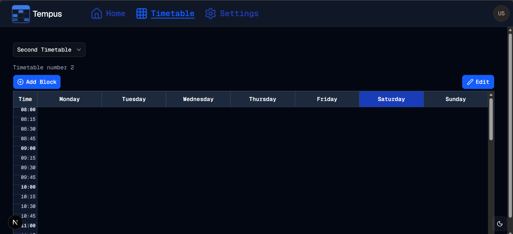

#  Topnav Tweaks
Welcome to **day 206** of 365 days of code - coding every day for a year, little and often

I'm probably not built for the dark arts of UI design, getting it exactly right and feeling good, but today was a day of small tweaks to the topnav to get it closer to feeling right. The two big things I did today were to add in the capability to highlight the topnav item that relates to the page currently shown (if it is one of the items up there), and because two items alone felt a little weird, I added back in settings. I know that means it's now in two places, not really too ideal, but on mobile particularly, it looked strange with just two icons, and even on a laptop, it still looks better.

Talking of mobile, I did also make some changes to the better-auth config and next config to allow a different remote origin, needed so I could test on my phone without building the container. I made the call to actually do this via ENV variables now, so I'm not exposing IP addresses in my git, but also to make it simpler next time I need to change this or turn it on.

I also had a play with the elements in the topnav, including adding custom sizing to the icons, centering the text, and changing colours of them.

I think I actually need to make things smaller in the topnav and make the whole thing smaller, something for me to play with tomorrow. I also need to adjust the timetable page as I had it set for a full height screen, and now that the top nav is there, it's resulted in a second scrollbar turning up, which as you can see in the screenshot, looks really naff. 

Anyway, that's enough for today, more tomorrow!

> [!NOTE]
> For this Tempus I won't be copying the whole codebase into this repo every time I work on it, instead I'll just [link to the repo](https://github.com/ASam08/tempus) and even link [direct to the commit here](https://github.com/ASam08/tempus/commit/35bc69c454a1a322b4865b3f9f280f3f29ca6342) if someone wants to go have a look at that point in time.

