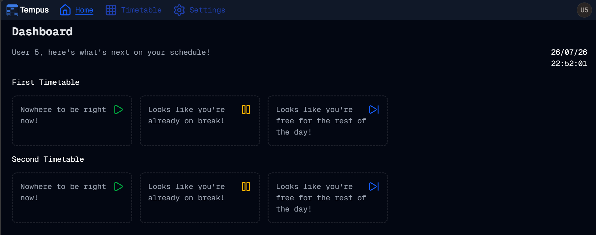

#  More Topnav Tweaks
Welcome to **day 207** of 365 days of code - coding every day for a year, little and often

I really feel like I could spend a week just on tweaking this topnav and resulting layouts, but I'm calling it quits on that after today. I'm much happier than I was with it yesterday, and I think I have all of the resulting impacts managed or changed as well now.

I started off by making everything a little smaller, removing some of the additional padding, and that already got me to a better place. It was bugging me that the text in the logo and the text for the headers didn't line up though, so I altered the SVG for the logo to center the text vertically. I then went through the master layout and removed some padding between the navbar and the top of the content, and then went through every page element and removed the padding that was there too (there was quite a bit when you add it all together).

Becasue I had noticed it when I was looking through everything, I also removed the customer button colours on the timetable page, and removed a bit of unneccessary code for making the buttons appear solo or with the text. It still does this, I don't have two different button elements for it now though.

I think that's enough for today, tomorrow will be working through any changes to tests (I'm sure there will be plenty), and hopefully release this either tomorrow or the next day. More tomorrow!

> [!NOTE]
> For this Tempus I won't be copying the whole codebase into this repo every time I work on it, instead I'll just [link to the repo](https://github.com/ASam08/tempus) and even link [direct to the commit here](https://github.com/ASam08/tempus/commit/5a7d345cf1c01b87fd3a8f4ca1cc71d7b2acaf86) if someone wants to go have a look at that point in time.

