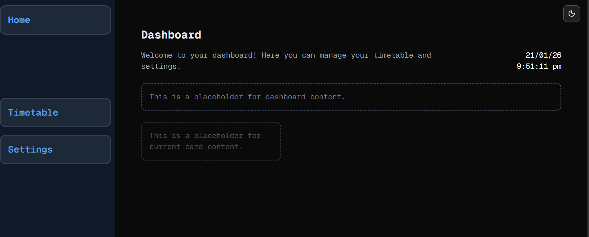

# Dem Bones
Welcome to **day 21** of 365 days of code - coding every day for a year, little and often

Ok, so day 2 of working on the timetable app, and really I'm just starting to look at the bones, the structure of the app. I went through today and created the structure of the "logged in" section, with a dashboard, timetable and settings pages, all just filled with placeholders at the moment. As part of that, I created the sidenav element, pretty basic so far, but as I mentioned yesterday, I'm learning tailwind as I go, and my design skills have never been awesome...no time like the present to learn!

I also had a go at creating some functions for the dashboard. I want to have the current date and time on the dashboard as it's a timetable app, so it sort of helps to know the current time. I've done this relevant to the users browser local time, it made sense to me, but maybe down the road I'll have to look at allowing the users to set their time zone (baby steps).

Fianlly, I started to think about the data structures I'm going to need, and started work on creating my data definitions, that I'll be using to read and write to the DB.

For this timetable project I won't be copying the whole codebase into this repo every time I work on it, instead I'll just [link to the repo](https://github.com/ASam08/timetable-app) and even link [direct to the commit here](https://github.com/ASam08/timetable-app/commit/131a213d65dcffc28e7ef12ae6323cb085b00887) if someone wants to go have a look at that point in time.

