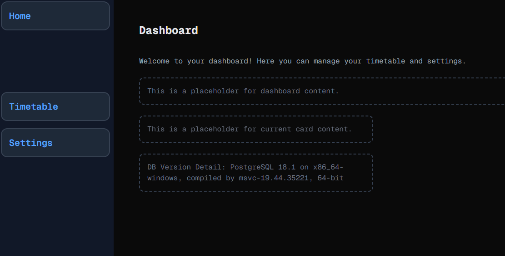

# Hello...Anyone There?
Welcome to **day 22** of 365 days of code - coding every day for a year, little and often

Oh man, today was one of those days. I thought to myself "lets get this database stuff over and done with, I'll get it set up with local postgres, connect away and start building the tables". 

Well, 20 minutes later I had the DB created.

Then a bunch of time and frustration later, and I could not for the life of me get a connection, nothing I tried, no amount of googling, no luck.
I went away and came back a bunch of times, and finally on the last time, I realised the rookie mistake I had made. I was wondering why I was getting an "undefined" when I tried to print the postgres connection URL to the console, so I was digging around at the .env file going crazy when I saw it... It wasn't greyed out in VSC to show that it was ignored by git. Now that's not great, luckily I hadn't made any commits since creating it, but wait, it's covered by the .gitignore, what the heck? Then I realised, I had created the .env in the parent folder for the project, not the project folder itself...

So after fixing that up, all of a sudden everything sprang to life. A 5 second fix, endless frustration, but a good learn in diagnosing issues, and to never ever do it again (hopefully).

Anyway, I didn't have time to do any more DB stuff today once I had it working, so I guess I get that joy another day!

> [!NOTE]
> For this timetable project I won't be copying the whole codebase into this repo every time I work on it, instead I'll just [link to the repo](https://github.com/ASam08/timetable-app) and even link [direct to the commit here](https://github.com/ASam08/timetable-app/commit/ae315527544a0a825c6866e70af5c80ba6a3519c) if someone wants to go have a look at that point in time.

