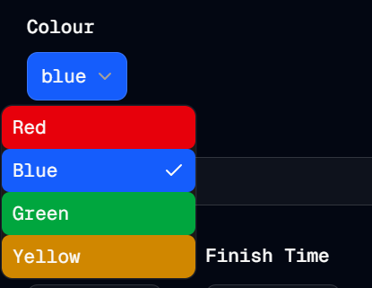

#  Colour Picker
Welcome to **day 220** of 365 days of code - coding every day for a year, little and often

Well after putting the todo list up yesterday, I have decided to work on something that I have been thinking about for a while, but wasn't on the list...of course.

I want to be able to colour code the timetable blocks. Now that sounds simple, but I do have to make a call: do I let each block be coloured independently, or do I provide a settings page (I guess in the create/edit sets page) to allow all blocks from the same subject to be set to the same colour. I think I'll probably go with a mix, allow subjects to be coloured as a whole, but also allow individual colours for specific blocks if the user wants. This probably means doing a few things:
1. Adding a colour field to the blocks
2. Adding a subjects table to handle the colour per subject links
3. Adding in a dropdown for the subject that allows new values
4. If it's a new subject, using the colour set for that first block as the default
5. Creating a colour picker

There is probably heaps more, but that's sort of the plan. Anyway, I started off on number 5, and created a very basic colour picker. It did feel like a bit of a shame that shadcn didn't have one, but for now I've used a select component, with an array of colours, and their various relevant tailwind styles. I've only added 4 for now as I was just putting together a first cut of it.

I actually am pretty pleased with this for a quick first go at it, I guess there is more tomorrow!

> [!NOTE]
> For this Tempus I won't be copying the whole codebase into this repo every time I work on it, instead I'll just [link to the repo](https://github.com/ASam08/tempus) and even link [direct to the commit here](https://github.com/ASam08/tempus/commit/d3a33d851d3d0befd3ee3e5e227c8f08f35d8703) if someone wants to go have a look at that point in time.

