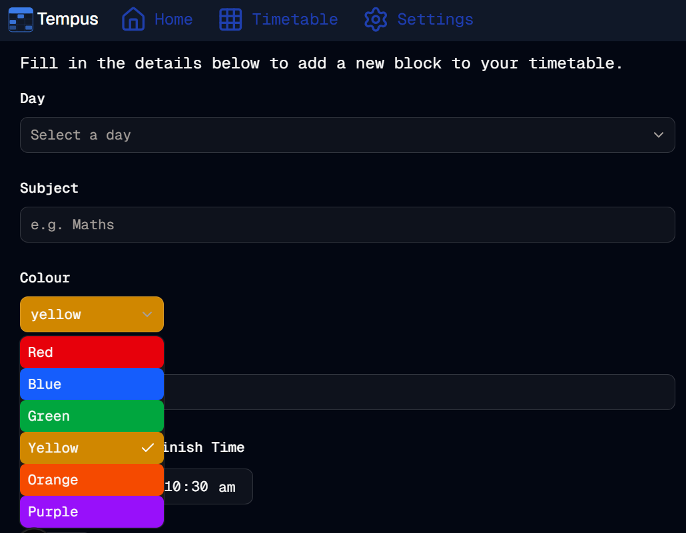

#  Colour Picker Refined
Welcome to **day 221** of 365 days of code - coding every day for a year, little and often

Today was another shorter day, and a bit of a tidy up and refine day for the colour picker. I kicked off by moving the colour list into the constants file, I'm guessing it's going to be used in a few places to good to have everything singing from the same song sheet there. I then moved the select to a controlled select, given the uncontrolled wasn't really suitable for the situation and was causing faults. I also added a few more colours, and then widened out the select trigger, and made the dropdown line up with the trigger.

All in all not a massive day, just incremental improvement. I guess I'll get onto some of the more meaty back end stuff tomorrow.

> [!NOTE]
> For this Tempus I won't be copying the whole codebase into this repo every time I work on it, instead I'll just [link to the repo](https://github.com/ASam08/tempus) and even link [direct to the commit here](https://github.com/ASam08/tempus/commit/a8cf5262e604bb1deec83d2c8321c1dcd9485558) if someone wants to go have a look at that point in time.

