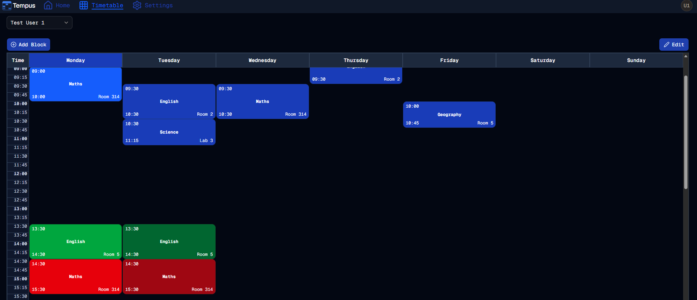

#  Let There Be Colour
Welcome to **day 222** of 365 days of code - coding every day for a year, little and often

> [!NOTE]
> For this Tempus I won't be copying the whole codebase into this repo every time I work on it, instead I'll just [link to the repo](https://github.com/ASam08/tempus) and even link [direct to the commit here](https://github.com/ASam08/tempus/commit/90dc1b71026e0c6aaf4eb9902be72d7d1287f444) if someone wants to go have a look at that point in time.

