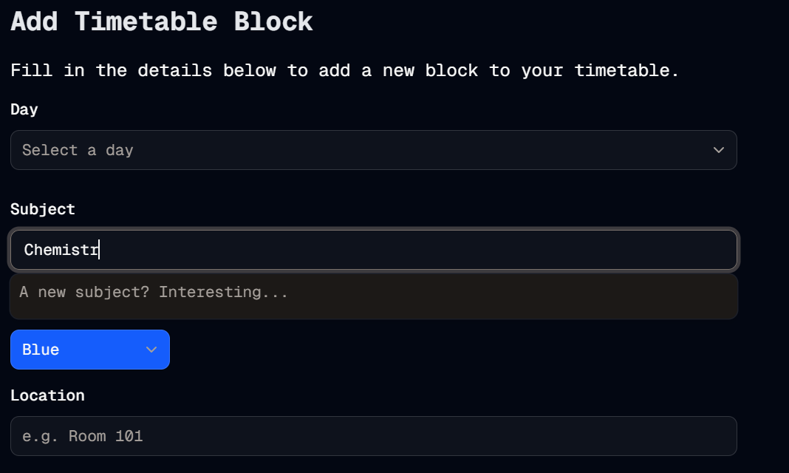

#  Autocomplete
Welcome to **day 226** of 365 days of code - coding every day for a year, little and often

Well today was a day to really push the boat out. After thinking about it, and doing a bit of looking around, I realised that the autocomplete component wasn't in the shadcn library, so this was a chance to do it for myself.

Now, full disclosure, I was not super confident with what I was doing here, so there was a lot of looking at the style of the existing shadcn components, and also a fair bit of double checking with Claude, but I'm pretty happy with the outcome, and importantly, it works!

It looks like it belongs, it works, and (so far) no errors. I will test it a bit more as I add it into the edittimetableblock form as well, I'm sure there will be stuff that comes up (like does it handle having the default value there?), but it's a great starting point.

Anyway, that's more than enough for today, more tomorrow!

> [!NOTE]
> For this Tempus I won't be copying the whole codebase into this repo every time I work on it, instead I'll just [link to the repo](https://github.com/ASam08/tempus) and even link [direct to the commit here](https://github.com/ASam08/tempus/commit/24ddb96d907202d8d82f65e3386026044b86863d) if someone wants to go have a look at that point in time.

