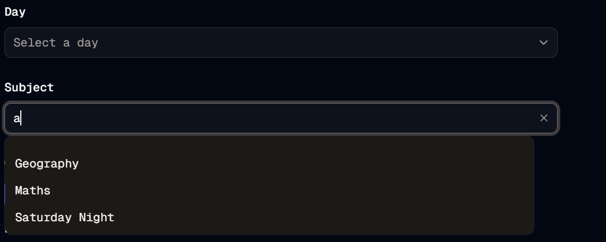

#  Autocomplete Clear
Welcome to **day 227** of 365 days of code - coding every day for a year, little and often

Today was a bit of an up and down day. I started off by working through adding the autocomplete into the edittimetableblock flow, after a small slipup with the default value (I'm using a state, why not just use that instead?), I decided I wanted to branch out and add a clear "x" instead of getting users to delete all their characters. After some frustrations, I finally got this working, using a very similar method to what is in the shadcn combobox component, a showClear prop in the autocompleteInput function.

Anyway, so with that working, I then realised I wasn't getting the subjects list in the editblock form. Cue a bit of investigation, I had used userId insted of setId in the function call, easy fix, I'll just pass it the setId...oh wait, I don't have it...

So I edited the retrieve block by ID data function, added in setId, created another definition so I didn't have to go and update the very commonly used type that I had created, and cause extra data to be pulled that wasn't needed, and voila, done!

I did run a test build, which found a few failures, ironically all of which were in the test files, so I fixed them up quickly to get them going, but there is a ton I need to do on testing...tomorrow.

Like I said, a bit of a rollercoaster, but again I'm really pleased with the end result, back tomorrow for tests!

> [!NOTE]
> For this Tempus I won't be copying the whole codebase into this repo every time I work on it, instead I'll just [link to the repo](https://github.com/ASam08/tempus) and even link [direct to the commit here](https://github.com/ASam08/tempus/commit/cf1eada405aa9cf8648e2ed8a04768b0fe5dff71) if someone wants to go have a look at that point in time.

