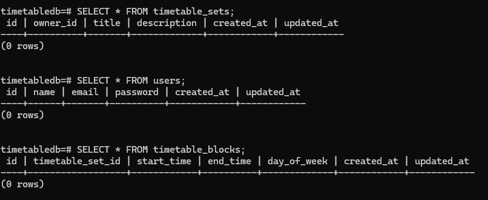

# Turning Tables?
Welcome to **day 23** of 365 days of code - coding every day for a year, little and often

Ok, so after the debacle that was yesterday, I was so tempted to ignore the DB for the day and concentrate on something else...but no, soldier on!

More success today, but less time to spend. I created a seed route to create the tables that I currently think I'll need, and then started to write my first data input function, creating a timetable set. 

Sidenote, that's what I'm calling an overall timetable, they'll get broken down from ***sets*** into timetable ***blocks*** (think lessons, periods etc.). All of the ***blocks*** will come together to make one timetable ***set***, AKA a timetable. The reason for having the idea of a ***set*** is that it will allow multiple timetables per user, maybe they want to be able to store their timetable and someone elses... who knows, that's the decision I've made and I'm sticking to it.

Anyway, the data input function is created, the database tables exist on my local postgres instance and can be recreated elsewhere, next step I guess is to build the input form, a job for another day.

> [!NOTE]
> For this timetable project I won't be copying the whole codebase into this repo every time I work on it, instead I'll just [link to the repo](https://github.com/ASam08/timetable-app) and even link [direct to the commit here](https://github.com/ASam08/timetable-app/commit/b6ad25a273e284a6eff6c1039ca0d687ccc347a0) if someone wants to go have a look at that point in time.

