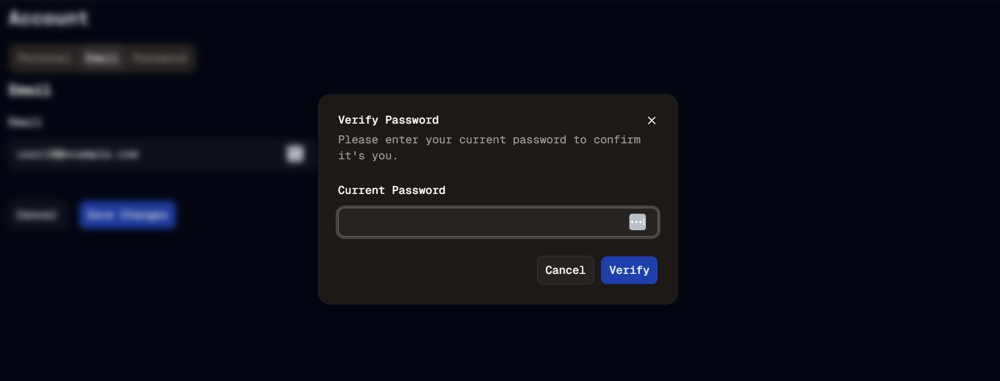

#  Prove Yourself Again
Welcome to **day 239** of 365 days of code - coding every day for a year, little and often

As I mentioned yesterday, I had run out of time to get the password verification piece operating properly, but today with a fresh set of eyes (ok, it was the end of the day, not so fresh), I sifted through everything, found the error of my ways, and got it all working. I'm not going to go into the detail of exactly what was wrong, because there was a lot wrong, but I do think I found the root cause. I tried to copy and paste and reuse code too much. This was probably something that I should have just written out from scratch, instead of copying bits from here and pieces from there, mashing it all together and hoping it would work. It got way to messy, way too fast.

Lessons learned, and ultimately it is working now, and I'm pretty happy with the experience of it.

I will have to spend a day or so with the testing, roll on tomorrow I guess!

> [!NOTE]
> For this Tempus I won't be copying the whole codebase into this repo every time I work on it, instead I'll just [link to the repo](https://github.com/ASam08/tempus) and even link [direct to the commit here](https://github.com/ASam08/tempus/commit/3227d858655afbe1a047456330bc7a69ff7f36ee) if someone wants to go have a look at that point in time.

