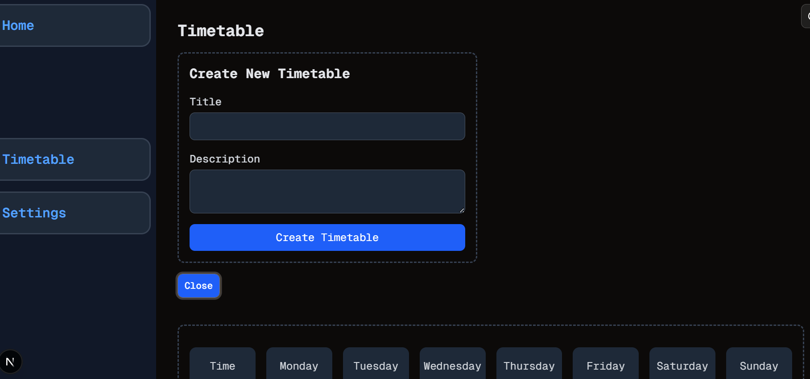

# First Functionality
Welcome to **day 24** of 365 days of code - coding every day for a year, little and often

A bit of a smoother day and starting to get some real stuff happening. I've created the form for adding a new timetable set, tested and then added it the timetable page. It's hidden with a show/hide button to open it up, and I got to add in some transitions for the first time in this project.

I've also started to frame out how the timetable screen layout might look, just a thought for now, it possibly feels a bit tight so will have to ponder it and try some alternatives.

I have been having an issue where adding hover: tailwind classes are not doing anything. I tried to do some diagnosis but I can't figure it out, reinstalled shadcn to see if it was something there but no luck, it's something I'll have to keep looking at.

> [!NOTE]
> For this timetable project I won't be copying the whole codebase into this repo every time I work on it, instead I'll just [link to the repo](https://github.com/ASam08/timetable-app) and even link [direct to the commit here](https://github.com/ASam08/timetable-app/commit/1820a67e80967d38802bf3e63de19c6229b93422) if someone wants to go have a look at that point in time.

