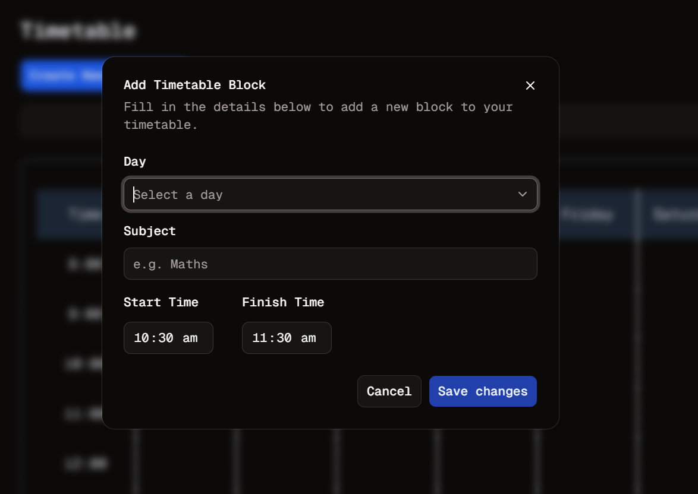

# Fixed The Hover
Welcome to **day 25** of 365 days of code - coding every day for a year, little and often

```@custom-variant hover (&:hover);``` One tiny line, one massive impact. Thanks to [this user and their helpful answer](https://github.com/tailwindlabs/tailwindcss/discussions/17225#discussioncomment-12610056) I finally managed to get hover styles working. Of course this was only after I replicated the project without Shadcn, just to find out it made no difference... frustrating but very happy to have an answer. It does turn out that I wouldn't have had this problem if my laptop didn't have a touchscreen, but then it would have appeared out in the wild if someone with a touchscreen ever decided to use this app...

Anyway, I also went ahead and started work on the "create timetable block" form. I took the opportunity to delve further into the shadcn stuff to see what was available and man it does look smooth. I probably should go back and make changes to the add timetable set form to get some consistency but I'm pretty stoked with the look of this. There is not functionality, validation etc. at all for this yet, just the pretty stuff, making it work is a job for another day.

> [!NOTE]
> For this timetable project I won't be copying the whole codebase into this repo every time I work on it, instead I'll just [link to the repo](https://github.com/ASam08/timetable-app) and even link [direct to the commit here](https://github.com/ASam08/timetable-app/commit/b3abb3fc45c86b47aac461ffde0e3e0599baf7bd) if someone wants to go have a look at that point in time.

